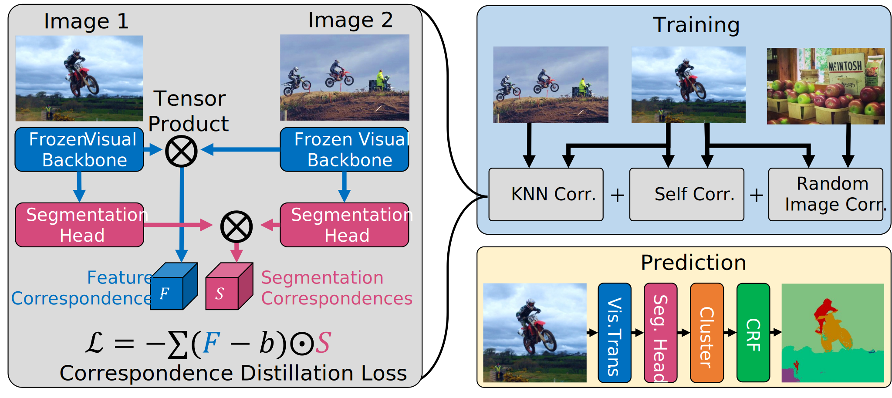
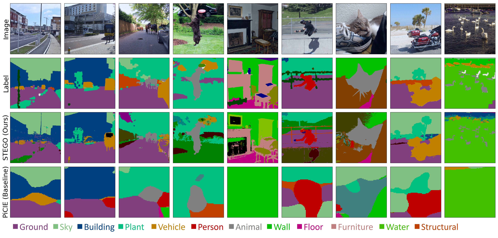

# STEGO: Unsupervised Semantic Segmentation by Distilling Feature Correspondences

Pytorch implementation of the STEGO unsupervised semantic segmentation system.
[[Paper]](https://arxiv.org/abs/2203.08414) [[Video]](https://aka.ms/stego-video)

	
[](https://paperswithcode.com/sota/unsupervised-semantic-segmentation-on?p=unsupervised-semantic-segmentation-by-2)\
[](https://paperswithcode.com/sota/unsupervised-semantic-segmentation-on-coco-4?p=unsupervised-semantic-segmentation-by-2) \
[](https://paperswithcode.com/sota/unsupervised-semantic-segmentation-on-potsdam-1?p=unsupervised-semantic-segmentation-by-2)






## Install

#### Clone this repository:
```
git clone https://github.com/mhamilton723/STEGO.git
cd STEGO
```

#### Install Conda Environment
Please visit the [Anaconda install page](https://docs.anaconda.com/anaconda/install/index.html) if you do not already have conda installed

```
conda env create -f environment.yml
conda activate stego
```

#### Download Pre-Trained Models

```
cd src
python download_models.py
```

#### Download Datasets

First, change the `pytorch_data_dir` variable to your 
systems pytorch data directory where datasets are stored. 

```
python download_datasets.py
```

Once downloaded please navigate to your pytorch data dir and unzip the resulting files:

```
cd /YOUR/PYTORCH/DATA/DIR
unzip cocostuff.zip
```


## Evaluation

From inside STEGO/src please run the following:
```
python eval_segmentation.py
```

## Training

From inside STEGO/src please run the following:
```
python train_segmentation.py
```

## Citation

```
@article{hamilton2022unsupervised,
  title={Unsupervised Semantic Segmentation by Distilling Feature Correspondences},
  author={Hamilton, Mark and Zhang, Zhoutong and Hariharan, Bharath and Snavely, Noah and Freeman, William T},
  journal={arXiv preprint arXiv:2203.08414},
  year={2022}
}
```
